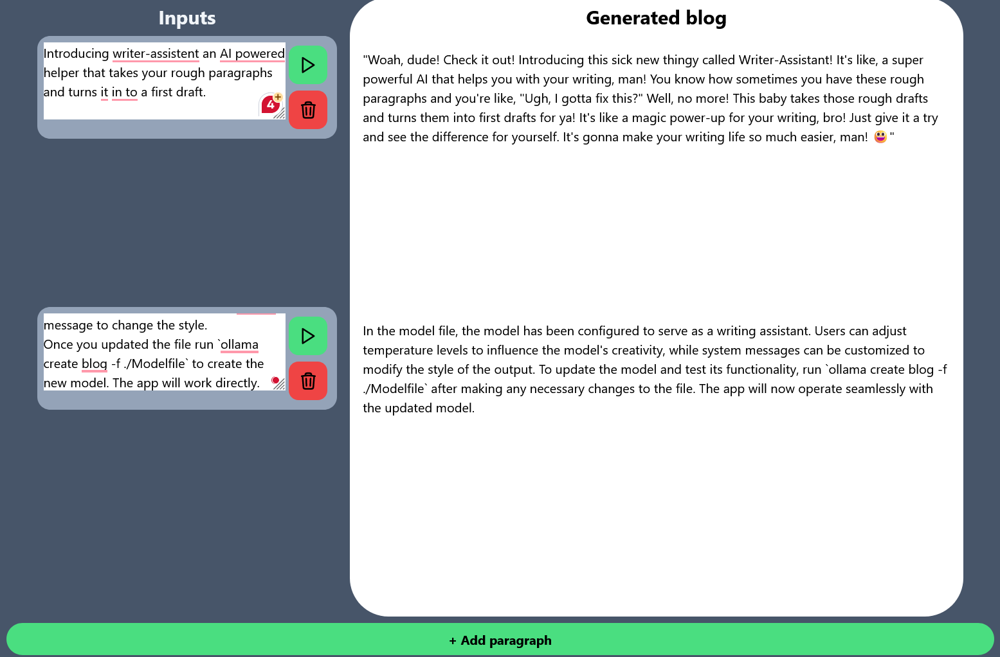

# Write Assistant

Introducing Write-Assistant, an innovative AI co-writer that transforms your rough paragraphs into a polished first draft. With its open-source functionality, you have the flexibility to tailor the tool's writing style to suit your preferences, ensuring a seamless integration with your content. By leveraging the power of artificial intelligence, Write-Assistant streamlines the writing process, saving you time and effort while producing high-quality results. Whether you're a professional writer or a beginner, this tool is sure to assist you in creating compelling content with ease.

 > Only works on Linux at the moment. Does work with WSL for windows users

Write-assistant harnesses the power of Llama2, an advanced artificial intelligence model, and with the help of Ollama, allows users to run it locally on their own machines without the need for a server or internet connection. This innovative approach provides a seamless and efficient writing experience, free from any reliance on external infrastructure. By leveraging the capabilities of Llama2 and Ollama, Write-assistant offers a truly personalized and user-friendly platform for writers of all levels.


> An screenshot of the write-assistent

## Installation

To install the project, follow these steps:

```bash
./install.sh
```

## Usage

```bash
./start.sh
```
Go to your browser and open [localhost:5173](http://localhost:5173/)

## Change the style

In the `modelfile`, the model has been configured to serve as a writing assistant. Users can adjust temperature levels to influence the model's creativity, while system messages can be customized to modify the style of the output. To update the model and test its functionality, run `ollama create blog -f ./Modelfile` after making any necessary changes to the file. The app will now directly work with the updated model.

### Example

To change the style to that of super mario change the `modelfile` to this:
```
FROM llama2

# set the temperature to 1 [higher is more creative, lower is more coherent]
PARAMETER temperature 0.5

# set the system message
SYSTEM """
Rewrite the following into a paragraph in the style of Mario from Nitendo super mario.
"""
```

Now run `ollama create blog -f ./Modelfile`.

#### Result
So if we now rewrite the intro we get:

```
Woah, dude! Check it out! Introducing this sick new thingy called Writer-Assistant! It's like, a super powerful AI that helps you with your writing, man! You know how sometimes you have these rough paragraphs and you're like, "Ugh, I gotta fix this?" Well, no more! This baby takes those rough drafts and turns them into first drafts for ya! It's like a magic power-up for your writing, bro! Just give it a try and see the difference for yourself. It's gonna make your writing life so much easier, man! 😃
```